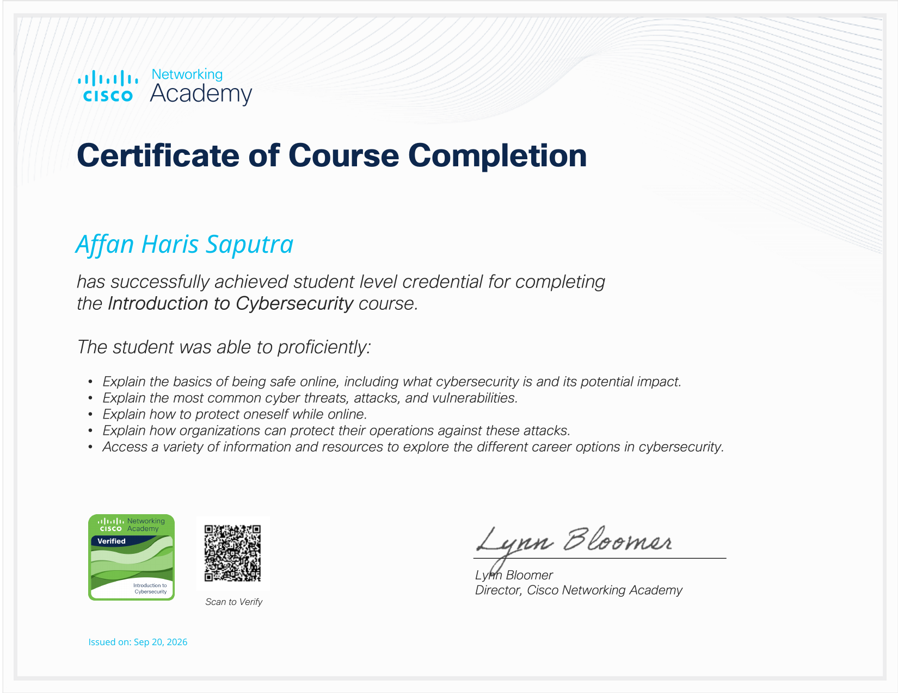
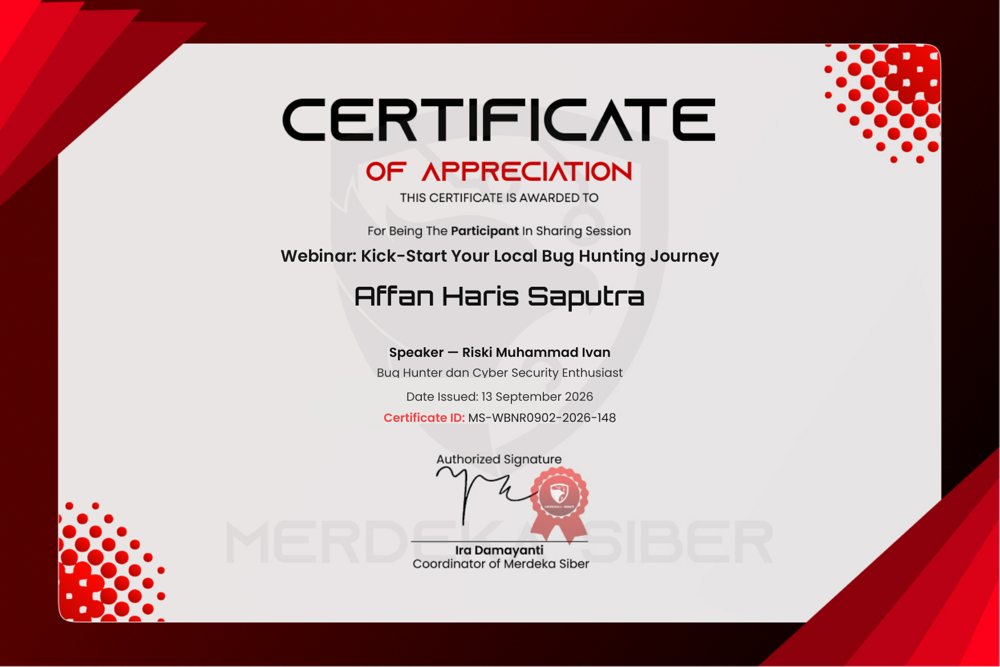

<!-- ============================================================ -->
<!--  Username GitHub: Affan-Haris-Saputra-cyber (sudah diisi)    -->
<!--  Ganti "GANTI_EMAIL" di bawah dengan email kamu yang aktif   -->
<!--                                                                -->
<!--  PENTING soal gambar sertifikat:                              -->
<!--  Folder "assets/certs/" (3 file gambar) HARUS kamu upload ke  -->
<!--  repo GitHub kamu (Affan-Haris-Saputra-cyber/Affan-Haris-     -->
<!--  Saputra-cyber) dengan struktur folder yang SAMA, baru gambar  -->
<!--  sertifikatnya akan muncul.                                    -->
<!--                                                                -->
<!--  Cari tag GANTI_REPO_1 / GANTI_REPO_2 untuk diisi dengan nama  -->
<!--  repo project andalanmu (atau hapus section Featured Projects  -->
<!--  kalau belum ada repo yang mau ditonjolkan)                    -->
<!-- ============================================================ -->

<div align="center">

# 🛡️ Affan Haris Saputra

### `> Aspiring Cyber Security Analyst_`

🔐 Cyber Security Enthusiast &nbsp;|&nbsp; 🌐 Network & Web App Security &nbsp;|&nbsp; 🚩 CTF Player &nbsp;|&nbsp; 📡 Mikrotik Networking

<br/>

<a href="https://linkedin.com/in/Affan-Haris-Saputra-cyber">
  
</a>
<a href="mailto:GANTI_EMAIL@gmail.com">
  
</a>
<a href="https://Affan-Haris-Saputra-cyber.github.io">
  
</a>
<a href="https://tryhackme.com/p/Affan-Haris-Saputra-cyber">
  
</a>

<br/><br/>


---

</div>

## 📡 root@affan:~# cat about.yml

```yaml
role: "Aspiring Cyber Security Analyst"
focus: ["Network Security", "Web Application Security"]
learning_method: "Self-taught — CTF, home lab, hands-on practice"
current_lab:
  - "Attacker-Victim environment (VirtualBox)"
  - "Network analysis dengan Nmap & Wireshark"
  - "Mikrotik: VLAN, Firewall/NAT, QoS, Hardening"
next_goal: "S1 Teknik Informatika / Sistem Informasi"
status: "Open untuk magang / entry-level Cyber Security"
```

<br/>

## 🗺️ Roadmap Perjalanan

<table>
<tr>
<td width="90" align="center"><b>🎓</b><br/><sub>13 Sep 2026</sub></td>
<td>
<b>Webinar — Kick-Start Your Local Bug Hunting Journey</b><br/>
<sub>Sesi berbagi bersama Riski Muhammad Ivan (Bug Hunter & Cyber Security Enthusiast)</sub>
</td>
</tr>
<tr>
<td align="center"><b>📜</b><br/><sub>20 Sep 2026</sub></td>
<td>
<b>Sertifikat Cisco — Introduction to Cybersecurity</b><br/>
<sub>Cisco Networking Academy, Course Completion Certificate</sub>
</td>
</tr>
<tr>
<td align="center"><b>🎓</b><br/><sub>27 Sep 2026</sub></td>
<td>
<b>Webinar — One Vulnerability, Big Impact!</b><br/>
<sub>Sesi berbagi bersama Rafasha Alfiandi Passage (Penetration Tester | Security Researcher)</sub>
</td>
</tr>
<tr>
<td align="center">🟢<br/><sub><b>Sekarang</b></sub></td>
<td>
<b>Fase belajar aktif</b><br/>
<sub>• Latihan CTF: Web Exploitation, Cryptography, Forensics<br/>
• Membangun lab attacker–victim mandiri (VirtualBox)<br/>
• Konfigurasi jaringan Mikrotik: VLAN, Firewall/NAT, QoS, hardening</sub>
</td>
</tr>
<tr>
<td align="center">⚪<br/><sub><b>Selanjutnya</b></sub></td>
<td>
<b>Target ke depan</b><br/>
<sub>• Melanjutkan S1 Teknik Informatika / Sistem Informasi<br/>
• Sertifikasi entry-level (CompTIA Security+ / eJPT)<br/>
• Magang / posisi entry-level Cyber Security Analyst</sub>
</td>
</tr>
</table>

<br/>

## 🛠️ Featured Projects

<table>
<tr>
<td width="50%" valign="top">
<h4>📁 GANTI_REPO_1</h4>
<p><i>Deskripsi singkat project di sini.</i></p>
<a href="https://github.com/Affan-Haris-Saputra-cyber/GANTI_REPO_1">Lihat Repo →</a>
</td>
<td width="50%" valign="top">
<h4>📁 GANTI_REPO_2</h4>
<p><i>Deskripsi singkat project di sini.</i></p>
<a href="https://github.com/Affan-Haris-Saputra-cyber/GANTI_REPO_2">Lihat Repo →</a>
</td>
</tr>
</table>

> 💡 *Ganti `GANTI_REPO_1`, `GANTI_REPO_2` dan deskripsinya dengan project kamu yang ingin ditonjolkan. Kalau belum ada, hapus saja section ini dulu — card berbasis gambar sengaja tidak dipakai di sini karena rawan gagal muncul.*

<br/>

## 🧰 Tumpukan Teknologi

### 💻 Bahasa Pemrograman
<div>
  
  
  
  
  
  
  
  
  
</div>

### 🎨 Frontend
<div>
  
  
  
  
  
  
  
  
</div>

### 🗄️ Backend, Database & API
<div>
  
  
  
  
  
  
</div>

### 🛠️ Alat & Platform
<div>
  
  
  
  
  
  
  
  
</div>

### ☁️ Komputasi Awan & Sistem Operasi
<div>
  
  
  
  
  
  
  
  
</div>

### 🤖 Alat AI
<div>
  
  
  
  
  
</div>

### 🔐 Keamanan Siber
<div>
  
  
  
  
  
  
  
  
  
  
  
  
  
  
  
  
</div>

<br/>

## 📊 Statistik GitHub

<div align="center">

<a href="https://github.com/Affan-Haris-Saputra-cyber?tab=repositories">
  
</a>
<a href="https://github.com/Affan-Haris-Saputra-cyber?tab=followers">
  
</a>
<br/><br/>
<a href="https://github.com/Affan-Haris-Saputra-cyber/Affan-Haris-Saputra-cyber">
  
</a>

</div>

<br/>

## 🏆 Sertifikat & Pencapaian

### 🎖️ Pencapaian

<div align="center">



**Cisco Networking Academy — Introduction to Cybersecurity**
Sertifikat Penyelesaian Kursus · Diterbitkan 20 September 2026
Ditandatangani oleh Lynn Bloomer, Director Cisco Networking Academy

</div>

<br/>

### 🎤 Webinar

<div align="center">




**Kiri:** *One Vulnerability, Big Impact!* — Speaker: Rafasha Alfiandi Passage (Penetration Tester | Security Researcher) · 27 September 2026 · ID: MS-WBNR0904-2026-031

**Kanan:** *Kick-Start Your Local Bug Hunting Journey* — Speaker: Riski Muhammad Ivan (Bug Hunter & Cyber Security Enthusiast) · 13 September 2026 · ID: MS-WBNR0902-2026-148

</div>

<br/>

---

<div align="center">

<b><i>Security is not a product, but a process.</i></b>

</div>
